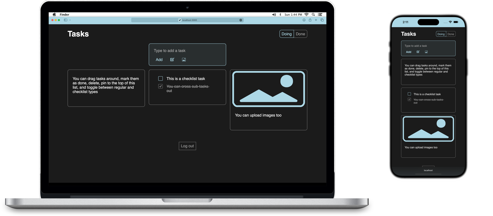

A web app for keeping track of tasks

# Setup

First, be sure mysql is running, `npm install` packages, and create an `.env` file based on `.env.example`.

Then start the server (`npm run server`) and app (`npm start`). Open [localhost:3000](http://localhost:3000) to view it in your browser. The page will reload when you make changes. Run with `--demo` arg to create demo data.

Build the app for production with `npm run build` to the `build` folder. The build is minified and the filenames include the hashes. See the [create-react-app deployment docs](https://facebook.github.io/create-react-app/docs/deployment) for more information.